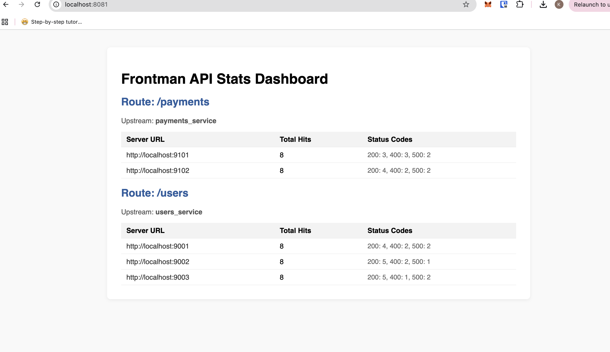

## 🚀 Frontman

A minimal reverse proxy and load balancer written in Go with a simple dashboard.

---

### Configuration (`frontman_config.json`)

```json
{
  "server": {
    "listen": 8080
  },
  "upstreams": [
    {
      "name": "users_service",
      "strategy": "round_robin",
      "servers": [
        "http://localhost:9001",
        "http://localhost:9002",
        "http://localhost:9003"
      ]
    },
    {
      "name": "payments_service",
      "strategy": "round_robin",
      "servers": [
        "http://localhost:9101",
        "http://localhost:9102"
      ]
    }
  ],
  "routes": [
    {
      "path": "/users",
      "upstream": "users_service"
    },
    {
      "path": "/payments",
      "upstream": "payments_service"
    }
  ]
}
```

---

### Routing

- `/users/*` → `users_service`
- `/payments/*` → `payments_service`
- Full request path is preserved.
- Load balancing strategy: `round_robin`

---

### Dashboard

Visit: `http://localhost:8081`


